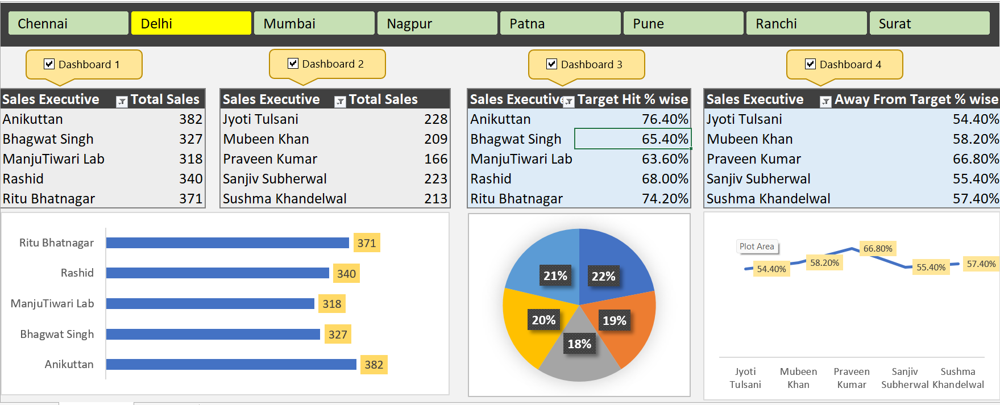

# Sales_Inventory_Analysis_Dashboard_Excel
An end-to-end Excel data analysis project that analyzes sales, purchases, and inventory data to derive business insights. The project uses Excel functions, pivot tables, and dashboards to calculate key metrics like revenue, cost, and gross profit and visualize sales performance.

## Project Overview
This project analyzes sales, purchase, and inventory data using Microsoft Excel.

The goal of the project is to generate business insights such as revenue, gross profit, and product performance.

## Tools Used
- Microsoft Excel
- Pivot Tables
- Excel Formulas
- Data Visualization

## Project Steps
1. Data Cleaning
2. Data Preparation
3. Pivot Table Analysis
4. Dashboard Creation

## Key Metrics
- Total Revenue
- Total Purchase Cost
- Gross Profit
- Sales Quantity

## Insights
- Identified top selling brands
- Analyzed monthly revenue trends
- Compared sales and purchase cost

## Dashboard Preview

